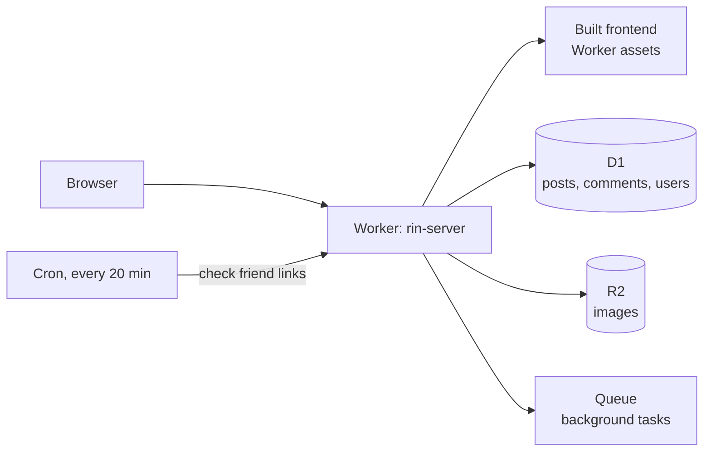
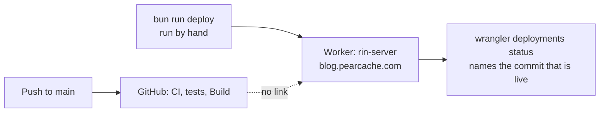

English | [简体中文](./README_zh_CN.md)

# Rin

Rin is a blog platform that runs entirely on Cloudflare. There is no server to
manage.

This repository is a fork of [openRin/Rin](https://github.com/openRin/Rin). It
runs the blog at `blog.pearcache.com`. For the original project, its demo and
its full documentation, see <https://docs.openrin.org>.

## How it fits together



One Worker does everything. It serves the built frontend from its own asset
store and answers the API. This fork does not use Cloudflare Pages.

| Part | Where it lives |
|---|---|
| Frontend | `client/` |
| Backend | `server/` |
| Shared types, config and UI | `packages/` |
| Command-line tool behind every `bun run` script | `cli/` |
| Documentation site | `docs/` |

## Features

- **Login.** GitHub OAuth, or a username and password. The first registered
  user becomes the administrator.
- **Writing.** A rich editor with drafts saved locally as you type, kept
  separate per article.
- **Privacy.** Mark an article "visible only to me", or keep it off the
  homepage list.
- **Images.** Drag, drop or paste to upload to S3-compatible storage such as
  Cloudflare R2.
- **Friendly addresses.** Give an article a custom address like `/about`.
- **Friend links.** Add links to other blogs. The backend checks they are
  reachable every 20 minutes.
- **Comments.** Reply to or delete comments, and get a webhook notification for
  new ones.
- **Cover images.** The first image in an article becomes its cover.
- **Tags.** Type `#Blog #Cloudflare` and the tags are picked out for you.
- **Type safety.** The client and server share TypeScript types through the
  `@rin/api` package.

## Quick start

You need [Bun](https://bun.sh).

```bash
git clone https://github.com/p-i-e-r-c-i-n-g-s/Rin.git && cd Rin
```

```bash
bun install
```

```bash
cp .env.example .env.local
```

Edit `.env.local` with your own settings, then:

```bash
bun run dev
```

Open <http://localhost:5173>.

## Testing

| Command | What it runs |
|---|---|
| `bun run test` | All tests |
| `bun run test:client` | Client tests only |
| `bun run test:server` | Server tests only |
| `bun run test:coverage` | All tests, with coverage |
| `bun run check` | Type checks |

## Deploying

**Merging to `main` does not deploy.** Every release is run by hand:

```bash
bun run deploy
```



| Command | What it deploys |
|---|---|
| `bun run deploy` | Backend and frontend, as one Worker |
| `bun run deploy --server` | Backend only |
| `bun run deploy --client` | Frontend only, to Cloudflare Pages. This fork does not use it. |

The target is a flag. There are no `deploy:server` or `deploy:client` scripts.

The deploy does these steps for you:

1. Creates the D1 database if it does not exist.
2. Works out the `S3_*` storage settings from `R2_BUCKET_NAME`, only when that
   is set.
3. Copies Worker secrets from your environment.
4. Builds the frontend.
5. Deploys the Worker, labelled with the commit it came from.
6. Runs database migrations.

### Settings

| Variable | Needed? | Meaning |
|---|---|---|
| `CLOUDFLARE_API_TOKEN` | Yes | Your Cloudflare API token |
| `CLOUDFLARE_ACCOUNT_ID` | Yes | Your Cloudflare account ID |
| `WORKER_NAME` | Optional | Worker name. Default `rin-server`. |
| `DB_NAME` | Optional | D1 database name. Default `rin`. |
| `R2_BUCKET_NAME` | Optional | R2 bucket for images. No bucket is chosen for you if unset. |
| `PAGES_NAME` | Optional | Pages project name, used only by `--client`. Default `rin-client`. |

### Checking what is live

```bash
bunx wrangler deployments status
```

A deploy uploads the files on your machine, not a commit. So each deploy is
labelled with the short commit hash, plus `-dirty` if there were uncommitted
changes. Use `status`, not `deployments list`. The list shows every version,
including ones that are not serving.

Checked on 27 Sep 2026:

| Evidence | Finding |
|---|---|
| Worker deployments | Latest is 26 Sep 2026, 08:56:29 UTC, labelled `3cee010` |
| `main` | Its newest commit is `3cee010`, so production matches `main` |
| GitHub Actions | No run at that time. CI, tests and Build last ran at 05:44 UTC and passed on `3cee010`. |
| Cloudflare Pages | The account has no Pages projects |
| Cloudflare Workers Builds | No builds for this Worker |

## GitHub Actions

| Workflow | What it does |
|---|---|
| `ci.yml` | Type checks and formatting, on every push and pull request |
| `test.yml` | Server and client tests, with coverage |
| `build.yml` | Builds the project |
| `clean.yml` | Runs when a pull request closes |
| `release.yml` | Runs when a version tag is pushed |
| `docs.yml` | Publishes the documentation site. Its latest run, on 24 Sep 2026, failed. |

**Nothing deploys from CI.** Upstream's `deploy.yml` was deleted from this fork
on 26 Sep 2026. It had never deployed here, and it was unsafe to turn on in a
public repository: it ran after `Build`, which also runs on pull requests from
forks, and it took its instructions from files a fork's pull request controls.
Do not restore upstream's copy.

## Who can reach it

`blog.pearcache.com` is public. A Cloudflare Access application named `blog`
gives that hostname a bypass policy for everyone (Access configuration read on
27 Sep 2026). The Worker's `workers.dev` address is switched off.

## Community

This fork has no community channels of its own. For help with Rin itself:

- Discord: <https://discord.gg/JWbSTHvAPN>
- Telegram: <https://t.me/openRin>
- [Upstream contributing guide](https://docs.openrin.org/en/guide/contribution.html)

## License

MIT License. Copyright (c) 2024 Xeu. See [LICENSE](./LICENSE).
