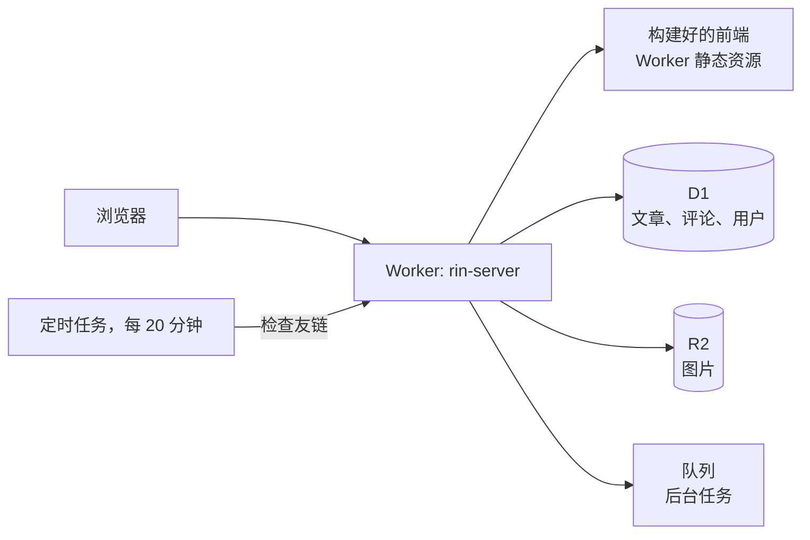
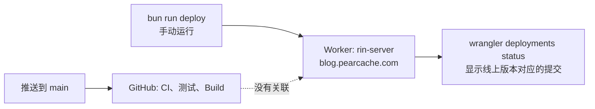

[English](./README.md) | 简体中文

# Rin

Rin 是一个完全运行在 Cloudflare 上的博客系统，不需要管理服务器。

本仓库是 [openRin/Rin](https://github.com/openRin/Rin) 的一个 fork，用于运行
`blog.pearcache.com`。原项目、在线演示和完整文档请见
<https://docs.openrin.org>。

## 整体结构



一个 Worker 完成所有工作：它从自己的静态资源中提供前端页面，同时响应 API
请求。本 fork 不使用 Cloudflare Pages。

| 部分 | 位置 |
|---|---|
| 前端 | `client/` |
| 后端 | `server/` |
| 共享的类型、配置和 UI | `packages/` |
| 所有 `bun run` 脚本背后的命令行工具 | `cli/` |
| 文档站点 | `docs/` |

## 功能特性

- **登录。** 支持 GitHub OAuth，也支持账号密码。首个注册用户自动成为管理员。
- **写作。** 功能丰富的编辑器，本地草稿实时自动保存，不同文章互不干扰。
- **隐私。** 可将文章标记为“仅自己可见”，也可以不在首页列表中显示。
- **图片。** 拖放或粘贴即可上传到兼容 S3 的存储（如 Cloudflare R2）。
- **自定义地址。** 为文章设置 `/about` 这样的友好地址。
- **友链。** 添加朋友的博客链接，后端每 20 分钟检查一次是否可访问。
- **评论。** 可回复或删除评论，新评论可通过 Webhook 通知。
- **封面图。** 文章中的第一张图片自动成为封面。
- **标签。** 输入 `#Blog #Cloudflare`，标签会被自动识别。
- **类型安全。** 客户端和服务器通过 `@rin/api` 包共享 TypeScript 类型。

## 快速开始

需要先安装 [Bun](https://bun.sh)。

```bash
git clone https://github.com/p-i-e-r-c-i-n-g-s/Rin.git && cd Rin
```

```bash
bun install
```

```bash
cp .env.example .env.local
```

编辑 `.env.local` 填入你的配置，然后运行：

```bash
bun run dev
```

访问 <http://localhost:5173>。

## 测试

| 命令 | 运行内容 |
|---|---|
| `bun run test` | 所有测试 |
| `bun run test:client` | 仅客户端测试 |
| `bun run test:server` | 仅服务器测试 |
| `bun run test:coverage` | 所有测试，并生成覆盖率 |
| `bun run check` | 类型检查 |

## 部署

**合并到 `main` 不会触发部署。** 每次发布都需要手动运行：

```bash
bun run deploy
```



| 命令 | 部署内容 |
|---|---|
| `bun run deploy` | 后端和前端，作为同一个 Worker |
| `bun run deploy --server` | 仅后端 |
| `bun run deploy --client` | 仅前端，部署到 Cloudflare Pages。本 fork 不使用。 |

部署目标通过参数指定。不存在 `deploy:server` 或 `deploy:client` 脚本。

部署脚本会自动完成以下步骤：

1. 如果 D1 数据库不存在，则创建。
2. 仅在设置了 `R2_BUCKET_NAME` 时，推导对应的 `S3_*` 存储配置。
3. 从环境变量同步 Worker 密钥。
4. 构建前端。
5. 部署 Worker，并标注其对应的提交。
6. 运行数据库迁移。

### 配置

| 变量 | 是否必需 | 含义 |
|---|---|---|
| `CLOUDFLARE_API_TOKEN` | 必需 | 你的 Cloudflare API 令牌 |
| `CLOUDFLARE_ACCOUNT_ID` | 必需 | 你的 Cloudflare 账户 ID |
| `WORKER_NAME` | 可选 | Worker 名称，默认 `rin-server` |
| `DB_NAME` | 可选 | D1 数据库名称，默认 `rin` |
| `R2_BUCKET_NAME` | 可选 | 存放图片的 R2 存储桶。未设置时不会自动选择任何存储桶。 |
| `PAGES_NAME` | 可选 | Pages 项目名称，仅 `--client` 使用，默认 `rin-client` |

### 确认线上版本

```bash
bunx wrangler deployments status
```

部署上传的是你本机的文件，而不是某个提交。因此每次部署都会标注提交的短哈希；
如果有未提交的改动，还会加上 `-dirty`。请使用 `status`，不要使用
`deployments list`：后者会列出所有版本，包括没有在提供服务的版本。

2026 年 9 月 27 日核实：

| 依据 | 结论 |
|---|---|
| Worker 部署记录 | 最新一次为 2026 年 9 月 26 日 08:56:29 UTC，标注为 `3cee010` |
| `main` 分支 | 最新提交是 `3cee010`，线上版本与 `main` 一致 |
| GitHub Actions | 该时间点没有任何运行。CI、测试和 Build 最近一次运行在 05:44 UTC，在 `3cee010` 上全部通过。 |
| Cloudflare Pages | 账户下没有任何 Pages 项目 |
| Cloudflare Workers Builds | 该 Worker 没有任何构建记录 |

## GitHub Actions

| 工作流 | 作用 |
|---|---|
| `ci.yml` | 每次推送和 PR 都运行类型检查和格式验证 |
| `test.yml` | 运行服务器和客户端测试，并生成覆盖率 |
| `build.yml` | 构建项目 |
| `clean.yml` | 在 PR 关闭时运行 |
| `release.yml` | 在推送版本标签时运行 |
| `docs.yml` | 发布文档站点。最近一次运行（2026 年 9 月 24 日）失败。 |

**CI 不会执行任何部署。** 上游的 `deploy.yml` 已于 2026 年 9 月 26 日从本 fork
中删除。它在这里从未真正部署过，而且在公开仓库中启用并不安全：它在 `Build`
之后运行，而 `Build` 也会在来自 fork 的 PR 上运行，并且它读取的指令来自 fork
的 PR 可以控制的文件。请不要恢复上游的版本。

## 谁可以访问

`blog.pearcache.com` 是公开的。名为 `blog` 的 Cloudflare Access 应用为该域名
设置了对所有人放行的策略（Access 配置读取于 2026 年 9 月 27 日）。Worker 的
`workers.dev` 地址已关闭。

## 社区

本 fork 没有自己的社区渠道。关于 Rin 本身的问题，请前往：

- Discord：<https://discord.gg/JWbSTHvAPN>
- Telegram：<https://t.me/openRin>
- [上游贡献指南](https://docs.openrin.org/guide/contribution.html)

## 许可证

MIT 许可证。Copyright (c) 2024 Xeu。详见 [LICENSE](./LICENSE)。
